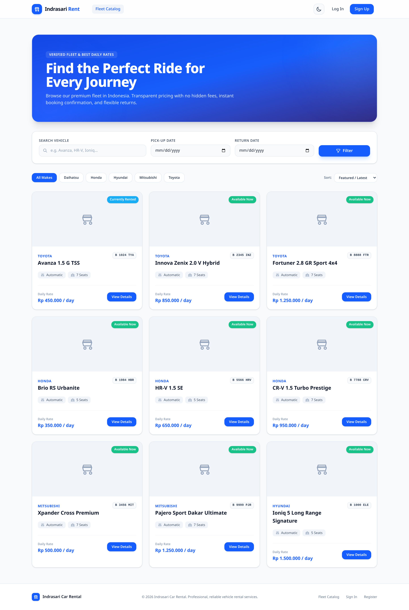
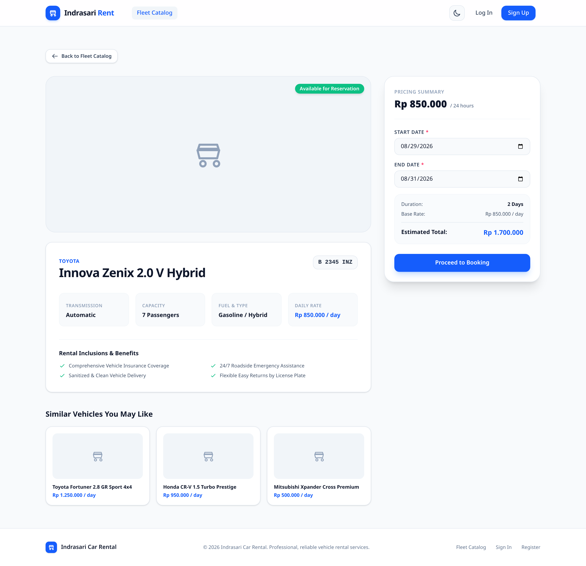
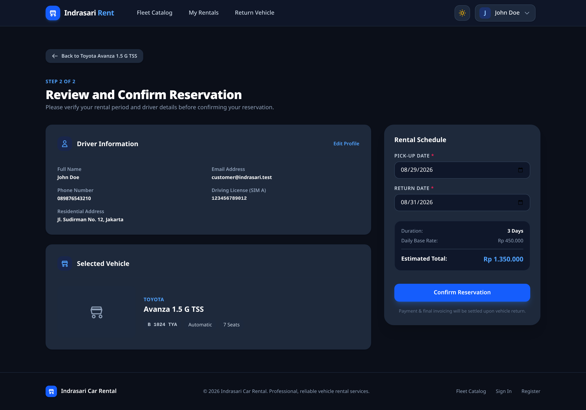
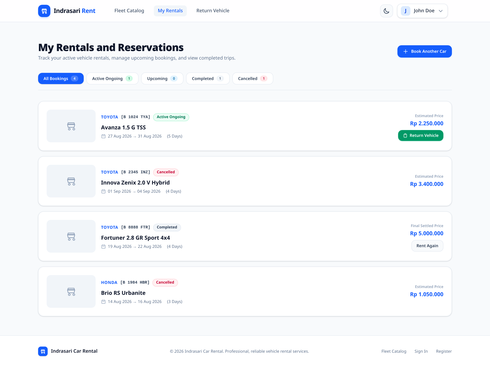
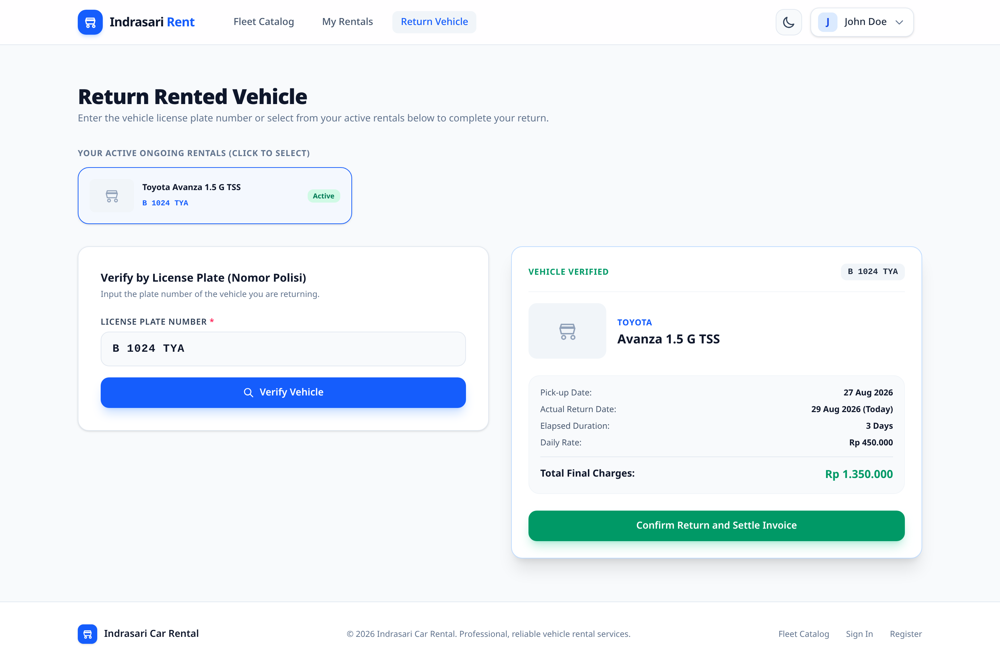
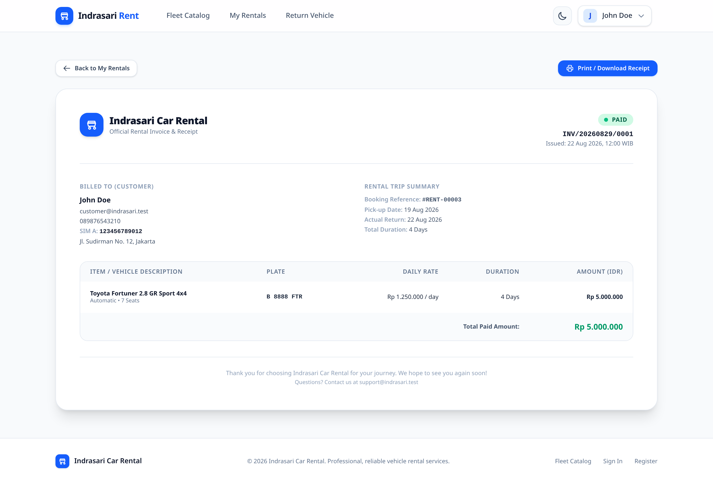
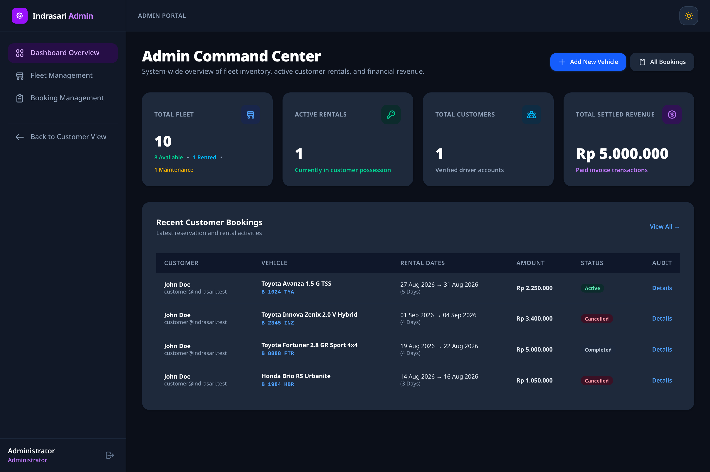
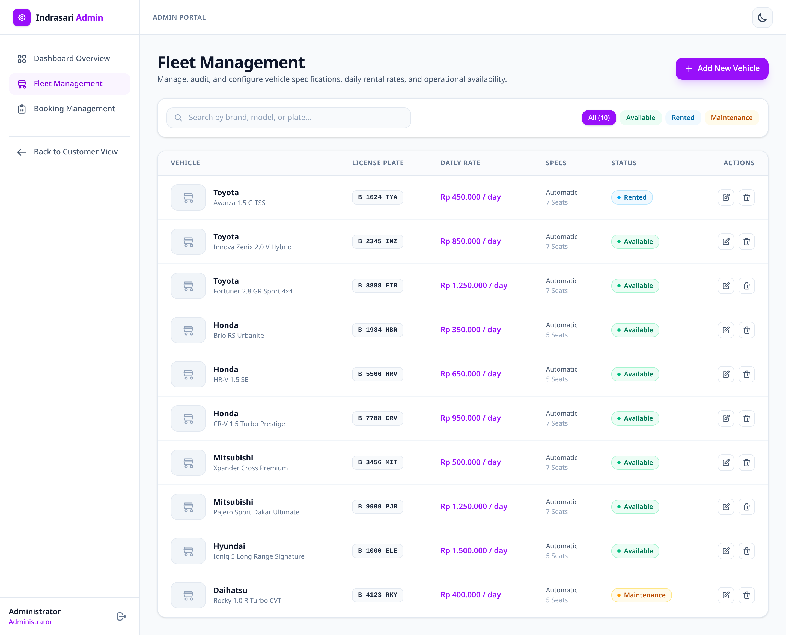
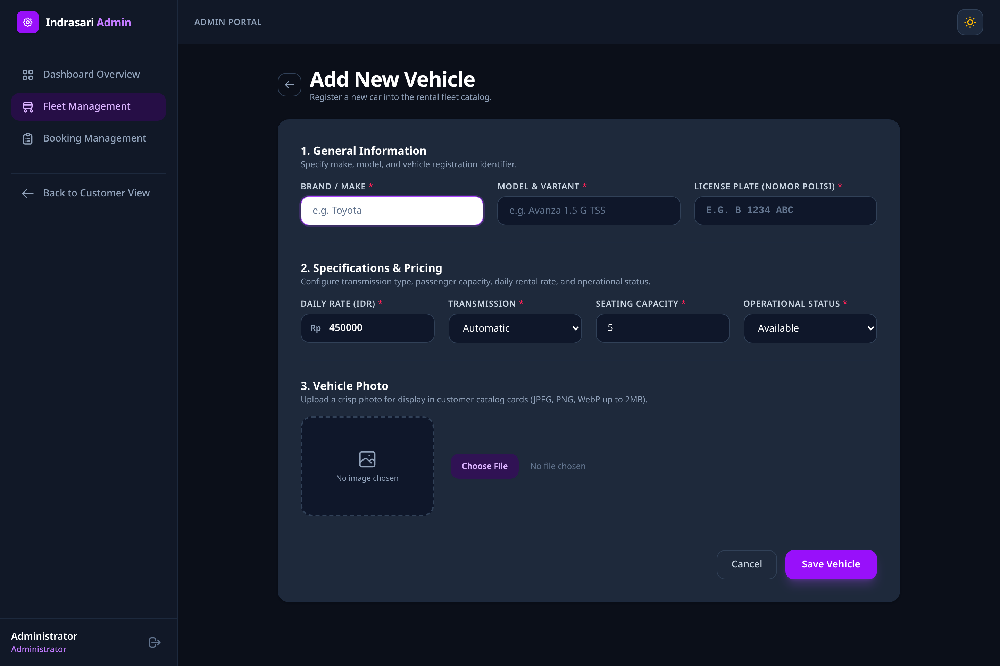
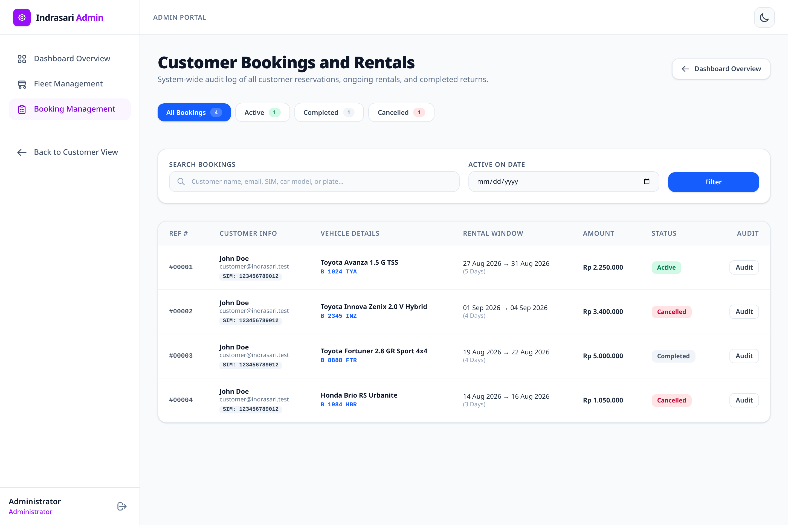

# 🚗 Indrasari Car Rental Management System

[](https://laravel.com)
[](https://php.net)
[](https://tailwindcss.com)
[-10B981?style=for-the-badge&logo=pest&logoColor=white)](https://pestphp.com)
[](LICENSE)

A modern, full-stack vehicle rental and fleet management platform engineered with **Laravel 13**, **Tailwind CSS v4**, **Alpine.js**, and **Pest PHP**. Designed with strict pessimistic database row locking to eliminate double-booking race conditions, a responsive dual-theme (Light/Dark) design system, automated duration billing with digital invoices, and a real-time admin command center.

---

## 📸 Visual Previews

### Customer Experience & Vehicle Catalog
| Vehicle Catalog (Light & Dark) | Vehicle Detail & Estimator |
|---|---|
|  |  |

| Checkout & Reservation Confirmation | Customer Rentals Dashboard |
|---|---|
|  |  |

| License Plate Return & Settlement | Official Printable Digital Invoice |
|---|---|
|  |  |

### Admin Command Center & Fleet Management
| Admin Command Center (KPI Dashboard) | Fleet Inventory Management |
|---|---|
|  |  |

| Add New Fleet Vehicle | Global Bookings Audit Ledger |
|---|---|
|  |  |

---

## 🌟 Key Features

### 1. 🔐 User Authentication & Role-Based Access Control
- **Dual User Roles**: `customer` and `admin` with dedicated navigation, route guards, and middleware (`AdminMiddleware`).
- **Driver License Verification**: Captures Indonesian Driving License (**SIM A**), phone number, and residential address during registration.
- **Customer Profile Center**: Update contact info, license number, and secure password updates with active session protection.
- **Adaptive Dual-Theme**: Zero-FOUC (Flash of Unstyled Content) Light & Dark modes supporting system preferences and persistent manual toggles.

### 2. 🚙 Admin Fleet Inventory & Asset Management
- **Full CRUD Management**: Register, audit, modify, and delete fleet vehicles with real-time operational status indicators (`available`, `rented`, `maintenance`).
- **Image Processing**: Secure vehicle photo uploads with automated storage cleanup on image replacement and vehicle deletion.
- **Smart Form Validation**: Real-time validation for license plate uniqueness, seating capacities (1–20), transmission types, and daily rates.

### 3. 🔍 Customer Catalog Browsing & Multi-Attribute Search
- **Faceted Fleet Search**: Filter by brand pills (Toyota, Honda, Mitsubishi, Hyundai, Daihatsu), transmission, seating capacity, price sorting, and specific date windows.
- **Availability Scope**: Automatically calculates overlapping reservations to display only vehicles available for the requested timeframe.
- **Dynamic Pricing Calculator**: Live client-side calculation estimating total cost based on pick-up and return dates.

### 4. 📅 Collision-Free Reservation & Booking Engine
- **Pessimistic Row Locking**: Uses `DB::transaction` with `Car::lockForUpdate()` to prevent date-collision race conditions during simultaneous checkout attempts.
- **Pre-filled Checkout**: Seamless booking verification pre-populating driver info and calculating rental duration.
- **Customer "My Rentals" Hub**: Filter reservations across *All*, *Active*, *Upcoming*, *Completed*, and *Cancelled* with built-in reservation cancellation rules.

### 5. 🧾 License Plate Vehicle Return & Digital Invoicing
- **Quick-Select Return**: Automatic license plate lookup and active possession quick-select pills.
- **Atomic Settlement**: Automatic duration calculation with a 1-day floor (`elapsed_days * daily_rate`), vehicle state restoration, and instant invoice generation (`INV/YYYYMMDD/XXXX`).
- **Printable Receipts**: Dual-theme digital invoice with `@media print` white-background stylesheet for clean physical printing and PDF export.

### 6. 📊 Admin Command Center & Global Booking Audits
- **Real-Time KPI Cards**: Total Fleet breakdown, Active Ongoing Rentals, Registered Drivers, and Total Settled Paid Revenue (in IDR).
- **System-Wide Booking Management**: Filter by status (*Active*, *Upcoming*, *Completed*, *Cancelled*), multi-attribute keyword search, and date filters.
- **Single Booking Audit**: Comprehensive inspection view showing driver SIM A, vehicle specs, duration timeline, and direct invoice linkage.

---

## 🛠️ Technology Stack

| Layer | Technologies |
|---|---|
| **Backend Framework** | [Laravel 13](https://laravel.com) (PHP 8.4+) |
| **Frontend & Styling** | [Tailwind CSS v4](https://tailwindcss.com), [Alpine.js](https://alpinejs.dev), Blade Templating, Vite |
| **Database & ORM** | MySQL 8.0 / MariaDB (Production), SQLite (Testing), Eloquent ORM |
| **Containerization** | Podman / Docker |
| **Automated Testing** | [Pest PHP](https://pestphp.com) (100 Feature Tests, 406 Assertions) |
| **Architecture Pattern** | Service Layer (`BookingService`, `ReturnService`), Form Requests, Scoped Eloquent Queries |

---

## 🚀 Getting Started

### Prerequisites
- PHP >= 8.2 (PHP 8.4 recommended)
- Composer
- Node.js (v18+) & npm
- Podman or Docker (or a local MySQL server)

### 1. Clone the Repository
```bash
git clone https://github.com/MF-Rozi/indrasari-car-rental-task.git
cd indrasari-car-rental-task
```

### 2. Install Dependencies
```bash
composer install
npm install
```

### 3. Environment Setup
```bash
cp .env.example .env
php artisan key:generate
```

### 4. Database Setup (Podman / Docker or Local MySQL)

#### Option A: Using Podman / Docker (Recommended)
```bash
# Start a MySQL 8.0 container on port 3306
podman run -d --name indrasari-car-rental-mysql \
  -e MYSQL_ALLOW_EMPTY_PASSWORD=yes \
  -e MYSQL_DATABASE=indrasari_car_rental_task \
  -p 3306:3306 mysql:8.0
```

#### Option B: Import Pre-Seeded SQL Dump
You can directly import the included database dump located at the root of the project:
```bash
podman exec -i indrasari-car-rental-mysql mysql -uroot indrasari_car_rental_task < indrasari_car_rental_task.sql
```

#### Option C: Run Laravel Migrations & Seeders
```bash
php artisan migrate:fresh --seed
php artisan storage:link
```

### 5. Compile Frontend Assets
```bash
npm run build
# Or for live hot-reloading:
npm run dev
```

### 6. Run the Application
```bash
php artisan serve
```
Visit the application in your browser at `http://localhost:8000`.

---

## 🔑 Default Credentials

The database seeder provisions the following pre-configured user accounts:

| Role | Email | Password | Access Level |
|---|---|---|---|
| **Administrator** | `admin@indrasari.test` | `password` | Full Admin Dashboard, Fleet Inventory CRUD, Global Booking Audits |
| **Customer** | `customer@indrasari.test` | `password` | Catalog Browsing, Checkout, My Rentals, Vehicle Returns, Invoices |

---

## 🧪 Automated Testing Suite

The project includes an exhaustive automated test suite written in **Pest PHP** covering all business logic, authorization guards, validation constraints, and database transactions:

```bash
php artisan test
```

### Test Suite Summary
```text
   PASS  Tests\Feature\Admin\AdminBookingManagementTest
   PASS  Tests\Feature\Admin\AdminBookingViewRenderingTest
   PASS  Tests\Feature\Admin\CarManagementTest
   PASS  Tests\Feature\Admin\CarSchemaAndSeederTest
   PASS  Tests\Feature\Admin\CarValidationTest
   PASS  Tests\Feature\Admin\CarViewRenderingTest
   PASS  Tests\Feature\Admin\DashboardControllerTest
   PASS  Tests\Feature\Admin\DashboardViewRenderingTest
   PASS  Tests\Feature\Auth\AuthenticationTest
   PASS  Tests\Feature\Auth\AuthorizationAndRoleTest
   PASS  Tests\Feature\Auth\ProfileTest
   PASS  Tests\Feature\Auth\UserSchemaTest
   PASS  Tests\Feature\Catalog\CarDetailsEndpointTest
   PASS  Tests\Feature\Catalog\CarDetailsViewRenderingTest
   PASS  Tests\Feature\Catalog\CarSearchScopeTest
   PASS  Tests\Feature\Catalog\CatalogControllerTest
   PASS  Tests\Feature\Catalog\CatalogViewRenderingTest
   PASS  Tests\Feature\Invoices\InvoiceSchemaTest
   PASS  Tests\Feature\Invoices\InvoiceViewRenderingTest
   PASS  Tests\Feature\Invoices\ReturnControllerTest
   PASS  Tests\Feature\Invoices\ReturnServiceTest
   PASS  Tests\Feature\Invoices\ReturnViewRenderingTest
   PASS  Tests\Feature\Rentals\BookingCollisionTest
   PASS  Tests\Feature\Rentals\CheckoutViewRenderingTest
   PASS  Tests\Feature\Rentals\MyRentalsViewRenderingTest
   PASS  Tests\Feature\Rentals\RentalControllerTest
   PASS  Tests\Feature\Rentals\RentalSchemaTest

  Tests:    100 passed (406 assertions)
  Duration: 2.35s
```

---

## 📁 Project Architecture & Directory Structure

```text
indrasari-car-rental-task/
├── app/
│   ├── Http/
│   │   ├── Controllers/
│   │   │   ├── Admin/
│   │   │   │   ├── BookingController.php      # Global booking audits & detail
│   │   │   │   ├── CarController.php          # Fleet inventory CRUD
│   │   │   │   └── DashboardController.php    # Admin KPI command center
│   │   │   ├── AuthController.php             # Login, Register, Logout
│   │   │   ├── CatalogController.php          # Catalog search & car detail
│   │   │   ├── InvoiceController.php          # Digital invoice presentation
│   │   │   ├── ProfileController.php          # Customer profile & security
│   │   │   ├── RentalController.php           # Booking checkout & cancellation
│   │   │   └── ReturnController.php           # Return processing by plate
│   │   └── Middleware/
│   │       └── AdminMiddleware.php            # Admin role authorization guard
│   ├── Models/
│   │   ├── Car.php                            # Fleet vehicle model & scopes
│   │   ├── Invoice.php                        # Digital invoice model
│   │   ├── Rental.php                         # Booking & rental contract model
│   │   └── User.php                           # User account with SIM validation
│   └── Services/
│       ├── BookingService.php                 # Collision-free atomic booking
│       └── ReturnService.php                  # Return duration & invoice settlement
├── database/
│   ├── migrations/                            # Schema migrations
│   └── seeders/                               # Car & user seeders
├── resources/
│   ├── css/                                   # Tailwind CSS v4 & theme rules
│   └── views/
│       ├── admin/                             # Admin views (Dashboard, Cars, Bookings)
│       ├── auth/                              # Authentication views
│       ├── catalog/                           # Public catalog & vehicle detail
│       ├── components/                        # Shared UI components (Navbar, Footer, etc.)
│       ├── invoices/                          # Printable invoice view
│       ├── profile/                           # Customer profile view
│       └── rentals/                           # Checkout, My Rentals, and Return views
├── screenshots/                               # High-resolution UI captures (Light & Dark)
├── tests/                                     # Pest test suite (100 Feature tests)
├── indrasari_car_rental_task.sql              # Exported database SQL dump
└── README.md                                  # Project documentation
```

---

## 📄 License

This project is open-sourced software licensed under the [MIT license](LICENSE).
