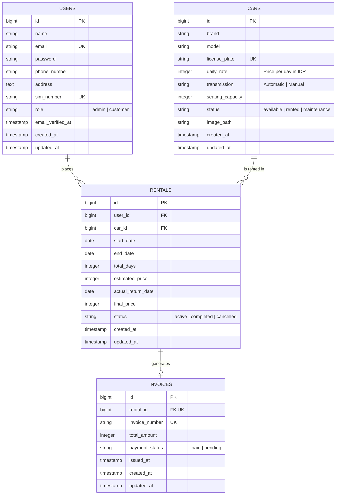

# Entity-Relationship Diagram (ERD)

This document specifies the database schema, entity definitions, attributes, data types, and foreign key relationships for the Indrasari Car Rental system.

---

## 1. Entity-Relationship Diagram

---

## 2. Table Specifications & Indexes

### `users` Table
| Column | Type | Constraints | Description |
|---|---|---|---|
| `id` | `BIGINT UNSIGNED` | `PRIMARY KEY`, `AUTO_INCREMENT` | Unique user ID |
| `name` | `VARCHAR(255)` | `NOT NULL` | User full name |
| `email` | `VARCHAR(255)` | `NOT NULL`, `UNIQUE` | User email for login |
| `password` | `VARCHAR(255)` | `NOT NULL` | Bcrypt hashed password |
| `phone_number` | `VARCHAR(50)` | `NOT NULL` | Contact telephone/mobile number |
| `address` | `TEXT` | `NOT NULL` | Residential address |
| `sim_number` | `VARCHAR(50)` | `NOT NULL`, `UNIQUE` | Driver's License Number (Nomor SIM) |
| `role` | `VARCHAR(20)` | `NOT NULL`, `DEFAULT 'customer'` | System role (`admin`, `customer`) |

### `cars` Table
| Column | Type | Constraints | Description |
|---|---|---|---|
| `id` | `BIGINT UNSIGNED` | `PRIMARY KEY`, `AUTO_INCREMENT` | Unique car ID |
| `brand` | `VARCHAR(100)` | `NOT NULL` | Manufacturer brand (e.g., Toyota, Honda) |
| `model` | `VARCHAR(100)` | `NOT NULL` | Car model name (e.g., Avanza, Civic) |
| `license_plate` | `VARCHAR(50)` | `NOT NULL`, `UNIQUE` | Vehicle plate number (e.g., B 1234 CD) |
| `daily_rate` | `INTEGER UNSIGNED` | `NOT NULL` | Rental tariff per day in IDR |
| `transmission` | `VARCHAR(20)` | `NOT NULL`, `DEFAULT 'Automatic'` | Transmission (`Automatic`, `Manual`) |
| `seating_capacity`| `TINYINT UNSIGNED` | `NOT NULL`, `DEFAULT 5` | Passenger seats capacity |
| `status` | `VARCHAR(20)` | `NOT NULL`, `DEFAULT 'available'` | Fleet status (`available`, `rented`, `maintenance`) |
| `image_path` | `VARCHAR(255)` | `NULLABLE` | Image asset location |

### `rentals` Table
| Column | Type | Constraints | Description |
|---|---|---|---|
| `id` | `BIGINT UNSIGNED` | `PRIMARY KEY`, `AUTO_INCREMENT` | Unique rental transaction ID |
| `user_id` | `BIGINT UNSIGNED` | `FOREIGN KEY (users.id)`, `CASCADE` | Customer who rented the car |
| `car_id` | `BIGINT UNSIGNED` | `FOREIGN KEY (cars.id)`, `CASCADE` | Rented vehicle |
| `start_date` | `DATE` | `NOT NULL` | Planned rental start date |
| `end_date` | `DATE` | `NOT NULL` | Planned rental end date |
| `total_days` | `INTEGER UNSIGNED` | `NOT NULL` | Scheduled duration in days |
| `estimated_price`| `INTEGER UNSIGNED` | `NOT NULL` | Estimated total cost |
| `actual_return_date`| `DATE` | `NULLABLE` | Date when car is returned |
| `final_price` | `INTEGER UNSIGNED` | `NULLABLE` | Calculated final charge on return |
| `status` | `VARCHAR(20)` | `NOT NULL`, `DEFAULT 'active'` | State (`active`, `completed`, `cancelled`) |

### `invoices` Table
| Column | Type | Constraints | Description |
|---|---|---|---|
| `id` | `BIGINT UNSIGNED` | `PRIMARY KEY`, `AUTO_INCREMENT` | Unique invoice ID |
| `rental_id` | `BIGINT UNSIGNED` | `FOREIGN KEY (rentals.id)`, `UNIQUE` | One-to-one link to rental |
| `invoice_number` | `VARCHAR(100)` | `NOT NULL`, `UNIQUE` | Auto-generated code (e.g., `INV-20260901-001`) |
| `total_amount` | `INTEGER UNSIGNED` | `NOT NULL` | Final amount charged |
| `payment_status` | `VARCHAR(20)` | `NOT NULL`, `DEFAULT 'paid'` | Payment state (`paid`, `pending`) |
| `issued_at` | `DATETIME` | `NOT NULL` | Generation timestamp |
