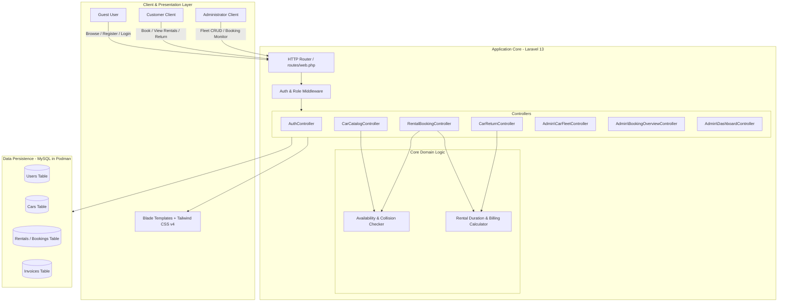
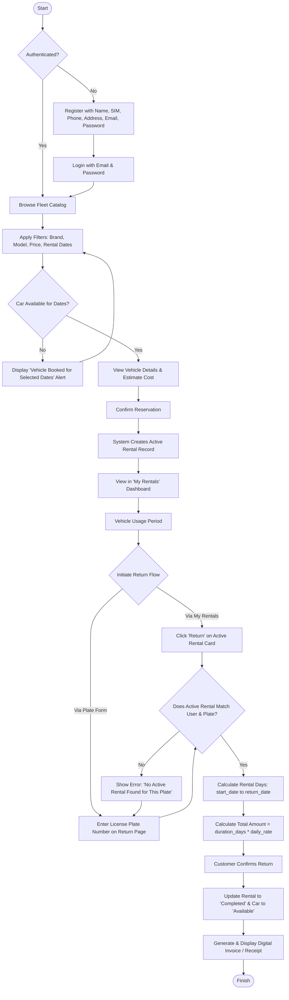
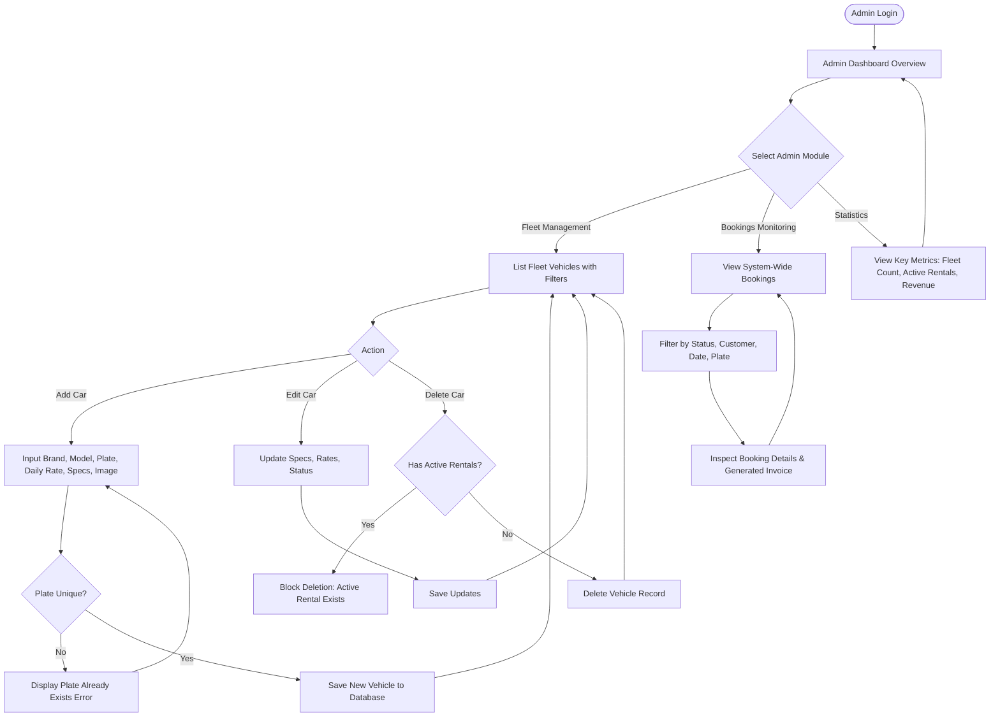

# System Flowcharts

This document details the architectural and user journey flowcharts for the Indrasari Car Rental application.

---

## 1. High-Level System Architecture Flowchart

---

## 2. Customer Journey Flowchart

---

## 3. Administrator Management Flowchart

