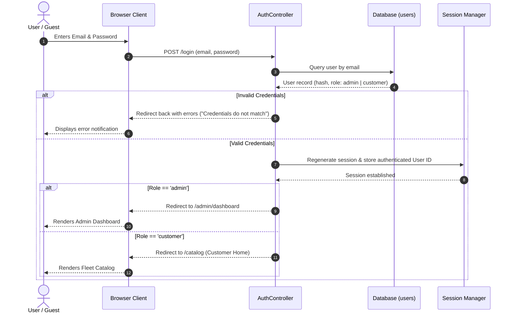
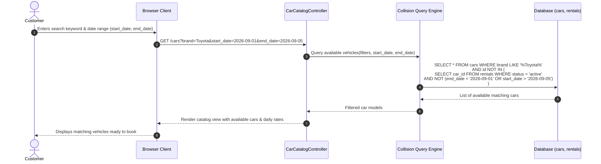
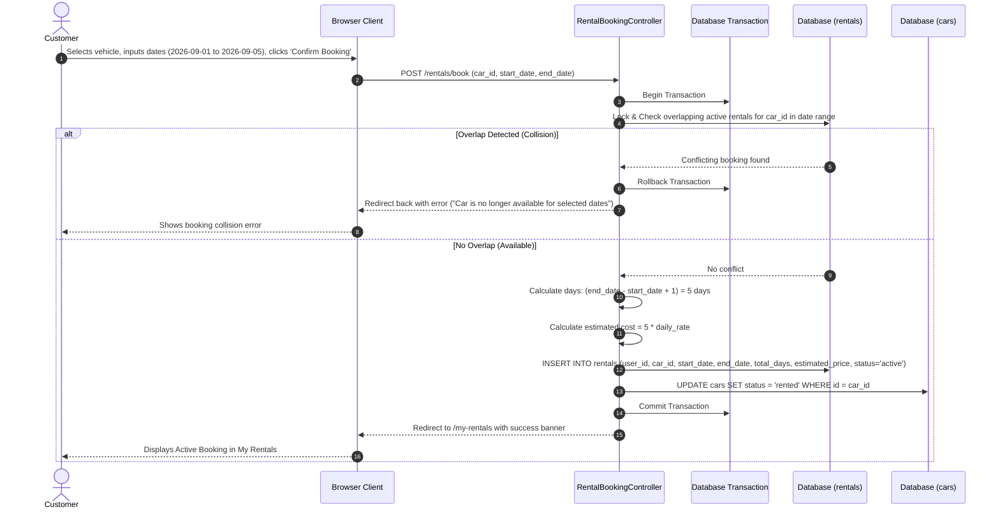
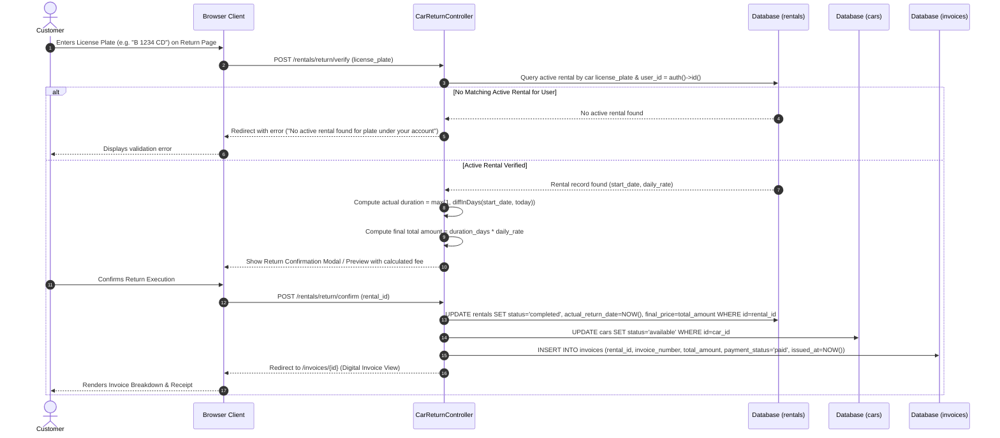

# System Sequence Diagrams

This document contains detailed UML sequence diagrams demonstrating the step-by-step interactions between the User, Web Controller, Domain Logic/Services, and Database.

---

## 1. Authentication & Role-Based Routing Sequence

---

## 2. Car Catalog Search with Date Overlap Check

---

## 3. Vehicle Booking & Reservation Sequence

---

## 4. Car Return by License Plate & Billing Sequence

