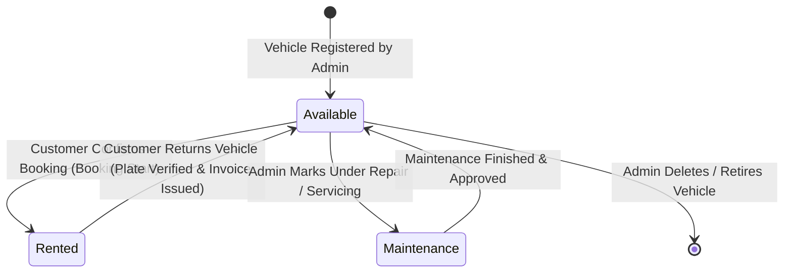
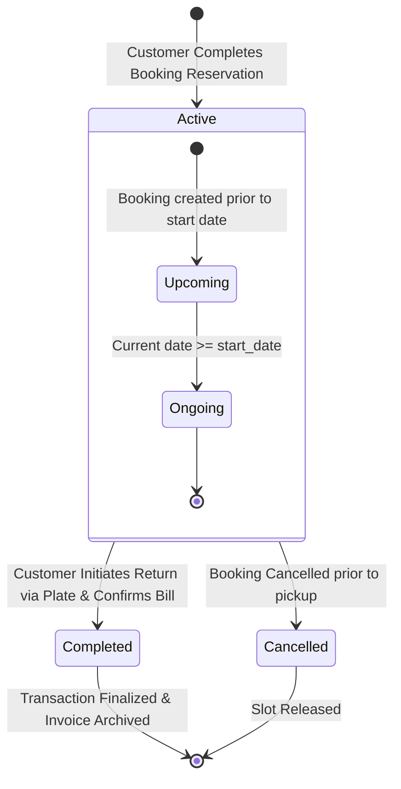

# State Transition Diagrams

This document illustrates the lifecycle states and transition triggers for vehicles and rental transactions in the Indrasari Car Rental system.

---

## 1. Vehicle Operational State Lifecycle

### Vehicle State Descriptions
- **`Available`:** Vehicle is in the fleet and ready to be discovered and reserved by customers across open date ranges.
- **`Rented`:** Vehicle is currently under an active rental agreement.
- **`Maintenance`:** Vehicle is temporarily out of service for inspection, repairs, or cleaning and excluded from booking.

---

## 2. Rental Booking Lifecycle

### Rental State Descriptions
- **`Active`:** The reservation is confirmed. The vehicle is reserved for the designated `start_date` to `end_date`.
- **`Completed`:** The customer has returned the vehicle by license plate number, duration and fees have been calculated, and the invoice has been issued.
- **`Cancelled`:** The booking was voided before the rental commenced, unlocking the car for other customers.
